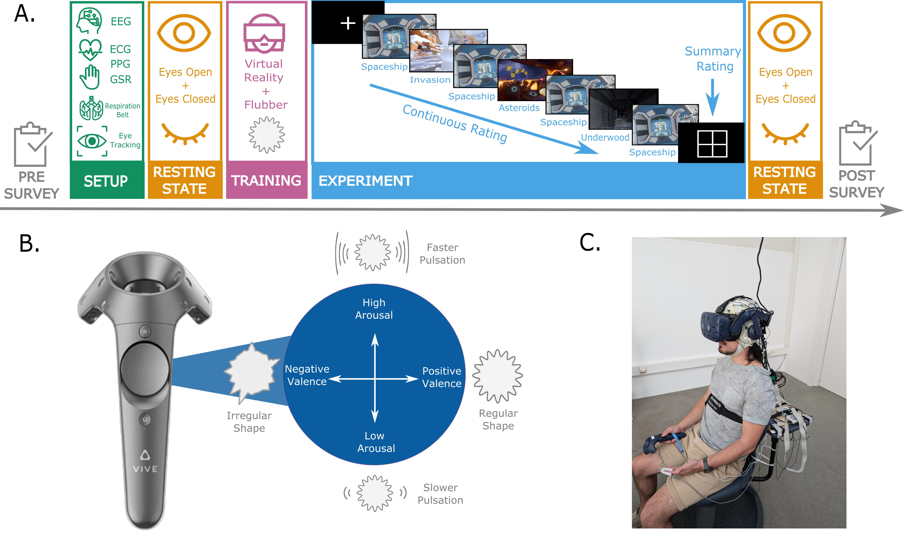

# AffectiveVR

`[Last update: August 28, 2024]`

    Period:     2023-10 - 2024-09
    Status:     work in progress

    Author(s):  Lucy Roellecke
    Contact:    lucy.roellecke[at]tuta.com

## Project description

*Affective VR* (AVR) aims to develop and test a tool for continous emotion ratings. The project proposes such a tool and assesses its effectiveness, usability and reliability using videos presented in virtual reality (VR).

## Project structure
The AVR project consists of three main stages: In the **Selection Phase**, three different rating methods ('Grid', 'Flubber' and 'Proprioceptive') were tested with different videos in VR of each 1 min length. In the **Evaluation Phase**, the 'Flubber' as winning rating method from the Selection Phase was tested for a longer VR experience of about 20 min with different videos playing after one another. In the **Physio Phase**, the very same stimuli and rating method are used but additionally to the behavioral data, EEG and periphysiological data are acquired.  



This repository mainly focuses on the Physio Phase as it contains code I wrote in the framework of my master thesis with the title **_Embodied Emotion: Decoding dynamic affective states by integrating neural and cardiac data_**. However, this repository also contains code and results of earlier phase of the project by PhD Candidate Antonin Fourcade that I could use and profit off during the analyses for the thesis.    

**Code** for all three phases can be found in `./code/AVR`.   
The whole preprocessing and analysis pipeline can be followed by running `main.py`.   
The directory `./code/AVR/preprocessing` contains scripts to preprocess annotation data and physiological data, respectively, of AVR Physio Phase.   
The directory `./code/AVR/statistics` contains scripts to calculate both univariate statistics, as well as modelling statistics.    
The directory `./code/AVR/datacomparison` contains scripts that compare continuous ratings from the Selection phase of the AVR project with the Physio Phase of the AVR project.    
The directory `./code/AVR/modelling` contains scripts to perform a Hidden Markov Model (HMM) analysis on data from the Physio phase to identify hidden affective states by using the physiological data.    
The directory `./code/AVR/datavisualization` contains plotting functions.   

     📂 code
     ├── 🐍 main.py
     ├── 📂 AVR
     │   ├── 📁 datacomparison
     │   ├── 📁 datavisualization
     │   ├── 📁 statistics
     │   ├── 📁 modelling
     │   └── 📁 preprocessing
     │       ├── 📁 annotation
     │       └── 📁 physiological 
     └── 📁 configs
     
The **results** of all analyses can be found in `./results`.    
There is one sub-directory in the main results directory for phase of the AVR project: `./results/phase1`, `./results/phase2`, `./results/phase3`, and `./results/comparison_phase1_phase2` and `./results/comparison_phase1_phase3` for comparing Selection and Evaluation/Physio phase.    

     📂 results
     ├── 📁 comparison_phase1_phase2
     ├── 📁 comparison_phase1_phase3
     ├── 📁 phase1
     │   ├── 📁 assessment_results
     │   ├── 📁 cocor_results
     │   ├── 📁 cor_results
     │   ├── 📁 cr_plots
     │   ├── 📁 datacomparison
     │   ├── 📁 datavisualization
     │   ├── 📁 descriptives
     │   └── 📁 icc_results
     ├── 📁 phase2
     │   ├── 📁 cpa
     │   └── 📁 descriptives
     └── 📁 phase3
          └── 📁 AVR

The **figures** published in my master thesis and the manuscripts can be found in `./publications`.    

     📂 publications
     ├── 📁 articles
     │   └── 📁 figures
     └── 📁 thesis
          └── 📁 figures

## Install research code as package

In case there is no project-related virtual / conda environment yet, create one for the project:

```shell
conda create -n AVR_3.11 python=3.11
```

And activate it:

```shell
conda activate AVR_3.11
```

Then install the code of the research project as python package:

```shell
# assuming your current working dircetory is the project root
pip install -e ".[develop]"
```

**Note**: The `-e` flag installs the package in editable mode,
i.e., changes to the code will be directly reflected in the installed package.
Moreover, the code keeps its access to the research data in the underlying folder structure.
Thus, the `-e` flag is recommended to use.

## Contributors/Collaborators

Antonin Fourcade   
Francesca Malandrone   
Michael Gaebler   

## License
MIT